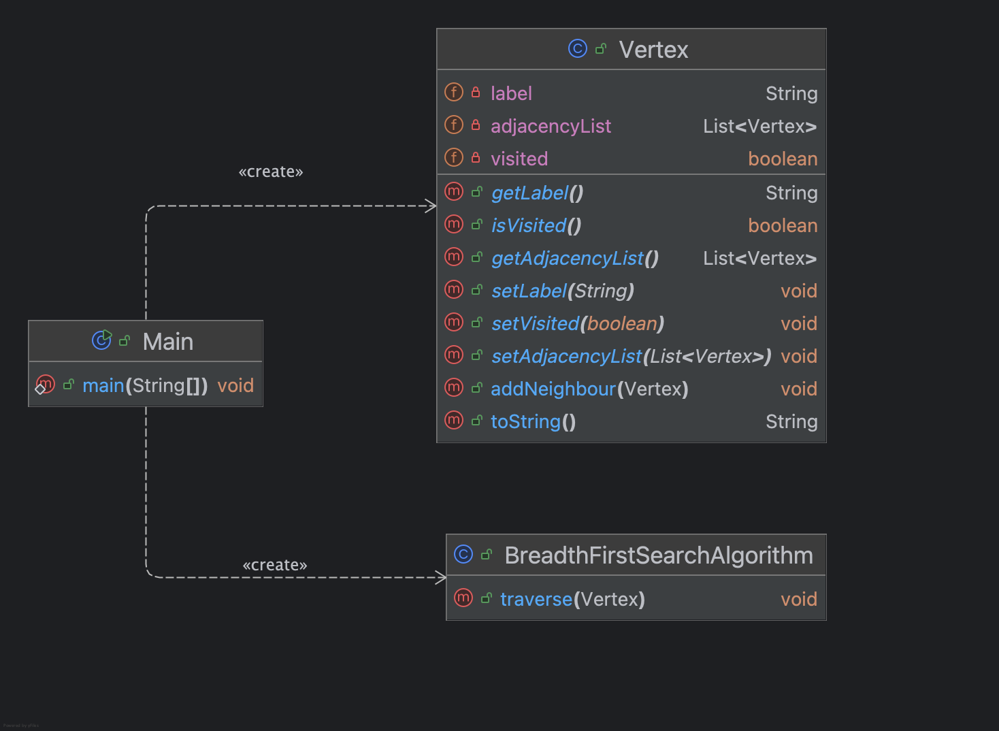

# Artificial Intelligence (AI) Algorithms

AI Algorithms Implemented in the Java Programming Language.

## 📚 Table of Contents

- [Breadth-First Search (BFS) Algorithm](#breadth-first-search-bfs-algorithm)

---

## Algorithm #01 - Breadth-First Search (BFS) Graph Traversal in Java

<div align="center">
  
  <br>
  <b>Figure 1:</b> UML Class diagram for Breadth-First Search
</div>

<br>
<details>
  <summary><strong>Click to expand: Explanation of BFS Java Implementation</strong></summary>
<br>
This Java program demonstrates the implementation of the **Breadth-First Search (BFS)** algorithm for traversing a graph data structure.

### 📌 Key Components

- **`Vertex` Class**
  - Represents a node in the graph with:
    - A `label` (e.g., `"A"`, `"B"`)
    - A list of neighboring vertices (`adjacencyList`)
    - A boolean `visited` flag to track traversal status
  - Includes a method `addNeighbour(Vertex)` to define graph connections.

- **`BreadthFirstSearchAlgorithm` Class**
  - Contains the `traverse(Vertex root)` method, which:
    - Initializes a queue
    - Marks the root vertex as visited
    - Iteratively visits each adjacent unvisited vertex in **breadth-first order**
    - Prints the label of each visited vertex

- **`Main` Class**
  - Constructs a test graph with the following layered structure:

    ```
                       A
                    /  |  \
                  B    F   G
                /  \       /
              C    D     H
                   /
                 E
    ```

  - Runs the BFS traversal starting from vertex **A**

### 🧪 Output Behavior

When executed, the program prints the vertices in the order they are visited by the BFS algorithm.  
For the given graph, the expected traversal order is:

